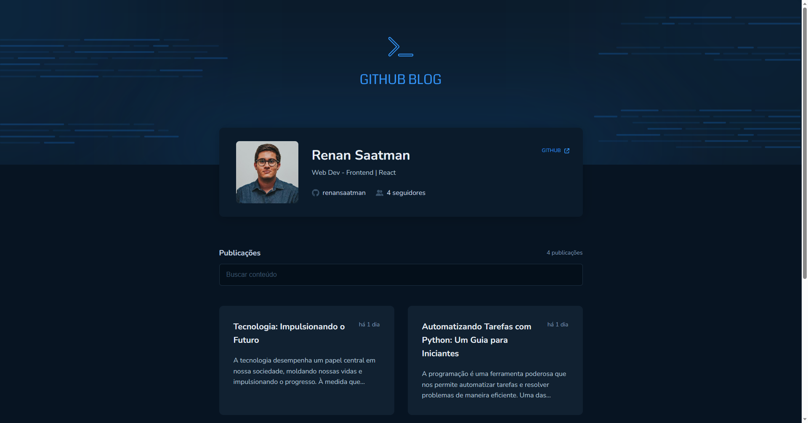
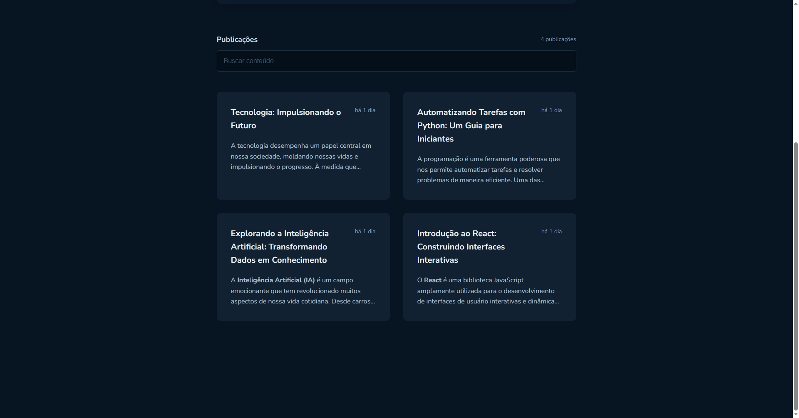
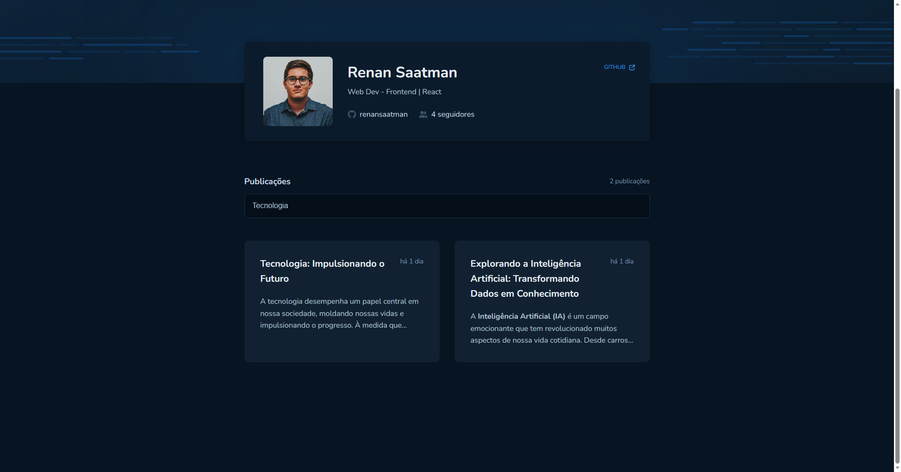
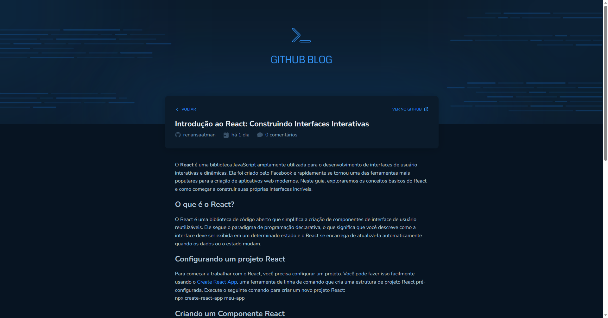
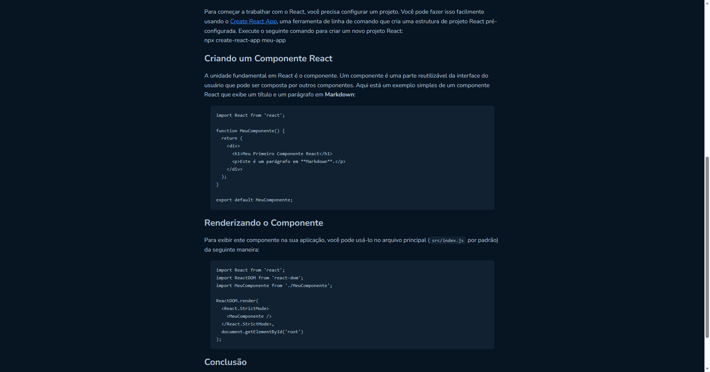

# Github Blog - Challenge 3 | Rocketseat :rocket:

Third challenge of the Rocketseat Ignite Course.

### :hammer_and_wrench: Tools:

- Vite
- React
- Typescript
- Styled Components
- Axios

### :white_check_mark: What you can do:

- Seach for a post
- Click on each post to see a full version 

### :camera: Screenshots

:computer: For desktop

    
    
    
    
    

